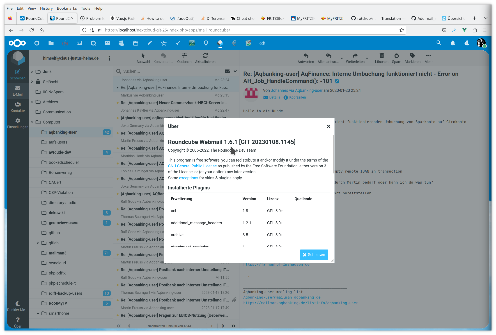
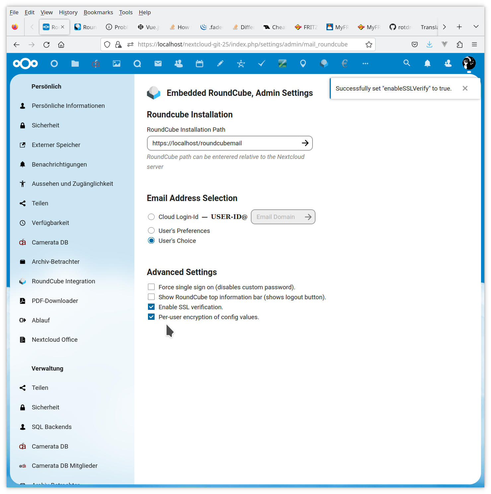
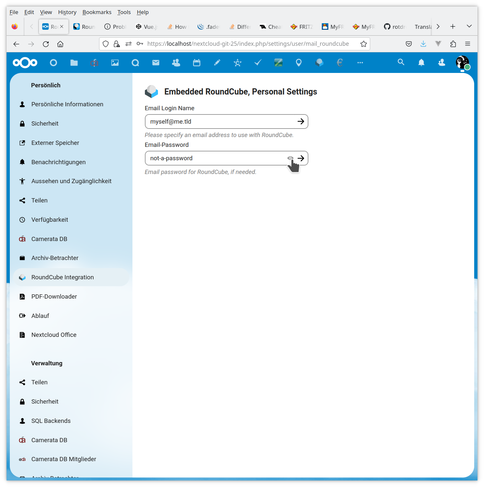

# BIG FAT NOTE: app renamed from roundcube -> mail_roundcube

# RoundCube Web Mail

<!-- markdown-toc start - Don't edit this section. Run M-x markdown-toc-refresh-toc -->
**Table of Contents**

- [BIG FAT NOTE: app renamed from roundcube -> mail_roundcube](#big-fat-note-app-renamed-from-roundcube---mail_roundcube)
- [RoundCube Web Mail](#roundcube-web-mail)
    - [Intro](#intro)
    - [Installation](#installation)
    - [More docs to follow ...](#more-docs-to-follow-)
    - [Screenshots](#screenshots)
        - [Main Window](#main-window)
        - [Preferences](#preferences)
            - [Admin Settings](#admin-settings)
            - [Personal Settings](#personal-settings)

<!-- markdown-toc end -->

## Intro

Ok, what is this:

This was originally a fork from

https://github.com/LeonardoRM/owncloud-roundcube

which in turn is based on a very early Owncloud app (discontinued)

https://github.com/hypery2k/owncloud

However, now this fork just concentrates to embed an external
Roundcube installation into a Nextcloud installation, there is no intent whatseover to keep
compatibility with Owncloud.

Knowning that there is nowaday a dedicated native Nextcloud email app this might be
questionable. OTOH, Roundcube is really a very mature email web app with many nice plugins like ACL
maintenance for folders (in particular shared folders), A Sieve plugin etc.

Currently the focus is on Roundcube version v1.6 and Nextcloud version
25 and on pushing this fork into the Nextcloud app-store.

Status is: hey, it works for me! Surprise!

Please feel free to submit issues, discussions, pull-request (<- most welcome, please do!).

NO guarantees. However, I am using a version of this beast in a
production setup as part of a groupware managing a quite active layman
orchestra in Germany. This means: I will at least see that it works
for me. However, the version you find here is highly experimental and
*not* what I am currently using.

## Installation

Hopefully an installation is possible by one of the following alternatives:

- ~install from the Nextcloud app-store~ (not yet)
- download a (pre-)release tarball and extract it into you app directory
- the assets are also contained in the git repo, so simply cloning the git-repo into your app folder *maybe* just works. Maybe not ...
- clone into your app-folder and compile from source, do a `make dev` or `make build`. You need `composer` and `node` (`npm`). `make help` or just `make` will list the available targets.

## More docs to follow ...

## Screenshots

### Main Window

### Preferences

#### Admin Settings

#### Personal Settings

